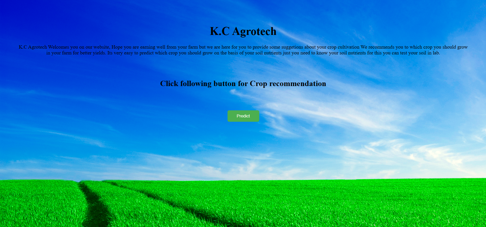
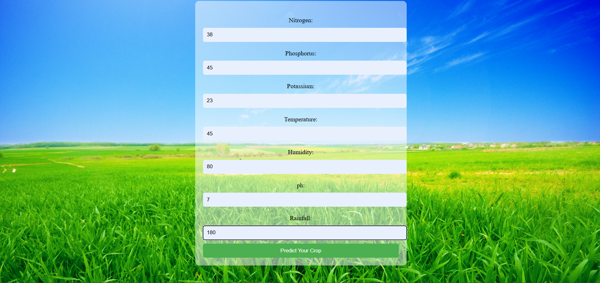
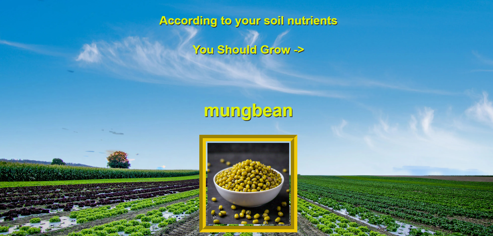

# 🌾 Crop Recommendation System

A machine learning-based web application that recommends the best crops to grow based on soil nutrients and environmental conditions. Built with Flask and Python, this application helps farmers make informed decisions about crop cultivation.

## 🚀 Features

- **Smart Crop Prediction**: Uses machine learning to predict optimal crops based on soil parameters
- **User-Friendly Interface**: Clean and intuitive web interface
- **Desktop Application**: Runs as a desktop app using pywebview
- **Real-time Predictions**: Instant crop recommendations based on input parameters
- **Visual Crop Display**: Shows crop images with predictions

## 📋 Prerequisites

- Python 3.7 or higher
- pip (Python package installer)

## 🛠️ Installation

1. **Clone the repository**
   ```bash
   git clone https://github.com/yourusername/crop-recommendation-system.git
   cd crop-recommendation-system
   ```

2. **Install dependencies**
   ```bash
   pip install -r crop_app3/requirements.txt
   ```

3. **Run the application**
   ```bash
   python crop_app3/crop_app.py
   ```

## 🎯 How to Use

1. **Launch the Application**: Run the Python script to start the desktop application
2. **Navigate to Prediction**: Click the "Predict" button on the home page
3. **Enter Soil Parameters**: Fill in the following soil and environmental parameters:
   - **Nitrogen** (0-100): Nitrogen content in soil
   - **Phosphorus** (0-100): Phosphorus content in soil
   - **Potassium** (0-100): Potassium content in soil
   - **Temperature** (0-100°C): Average temperature
   - **Humidity** (0-100%): Relative humidity
   - **pH** (0-14): Soil pH level
   - **Rainfall** (0-10000mm): Annual rainfall
4. **Get Recommendation**: Click "Predict Your Crop" to receive crop recommendations
5. **View Results**: See the recommended crop with its image

## 📊 Input Parameters

| Parameter | Range | Unit | Description |
|-----------|-------|------|-------------|
| Nitrogen | 0-100 | mg/kg | Nitrogen content in soil |
| Phosphorus | 0-100 | mg/kg | Phosphorus content in soil |
| Potassium | 0-100 | mg/kg | Potassium content in soil |
| Temperature | 0-100 | °C | Average temperature |
| Humidity | 0-100 | % | Relative humidity |
| pH | 0-14 | - | Soil pH level |
| Rainfall | 0-10000 | mm | Annual rainfall |

## 🏗️ Project Structure

```
crop_app3/
├── crop_app.py          # Main Flask application
├── crop_app             # Trained machine learning model
├── requirements.txt     # Python dependencies
├── templates/           # HTML templates
│   ├── Home_1.html     # Home page
│   ├── Index.html      # Prediction form
│   └── prediction.html # Results page
├── static/             # Static files
│   ├── images/         # Crop images
│   └── style/          # CSS stylesheets
└── crop/               # Additional project files
```

## 🎨 Screenshots

### Home Page


### Prediction Form


### Results Page


## 🤖 Machine Learning Model

The application uses a trained machine learning model (`crop_app`) that predicts crop recommendations based on:
- Soil nutrient levels (N, P, K)
- Environmental conditions (Temperature, Humidity, pH, Rainfall)
- Historical crop yield data

## 🛡️ Input Validation

The application includes validation for:
- pH values between 0-14
- Temperature below 100°C
- Positive humidity values
- All numeric inputs

## 🚀 Technologies Used

- **Backend**: Flask (Python web framework)
- **Frontend**: HTML, CSS, JavaScript
- **Desktop GUI**: pywebview
- **Machine Learning**: scikit-learn, joblib
- **Data Processing**: NumPy


## 🤝 Contributing

1. Fork the repository
2. Create a feature branch (`git checkout -b feature/AmazingFeature`)
3. Commit your changes (`git commit -m 'Add some AmazingFeature'`)
4. Push to the branch (`git push origin feature/AmazingFeature`)
5. Open a Pull Request

## 🙏 Acknowledgments

- Dataset providers for crop recommendation data
- Flask and pywebview communities
- Open source contributors

---

**Note**: This application is designed for educational and agricultural guidance purposes. Always consult with agricultural experts for critical farming decisions. 
